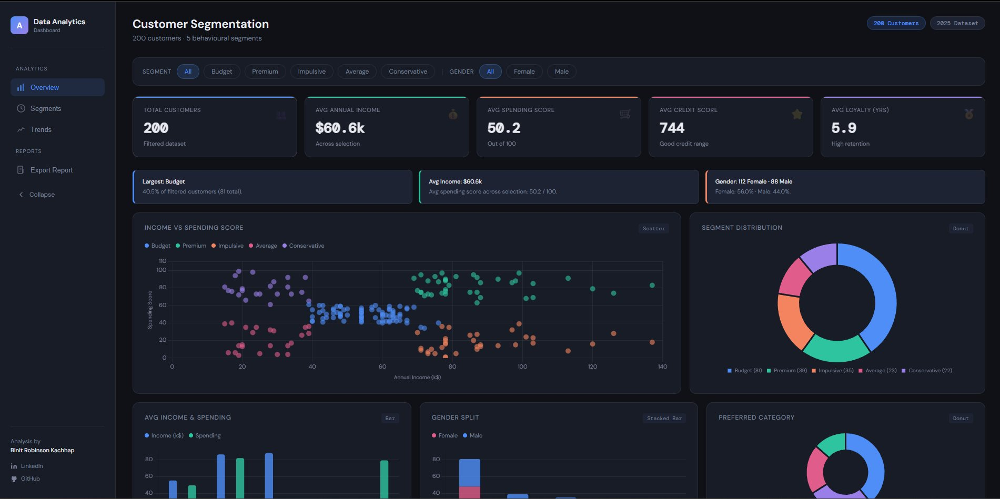
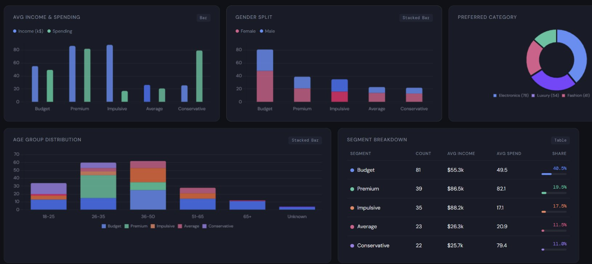

# 🎯 Customer Segmentation 
### Algonive Data Analytics Internship Project

---

## 📌 Overview

A customer segmentation system that categorizes **200 customers** into **5 behavioural segments** based on purchasing behaviour, demographics, and preferences. The project includes a fully interactive web dashboard with real-time filters, dynamic charts, and an exportable PDF report.
Dataset(kaggle)-https://www.kaggle.com/datasets/hosseinbadrnezhad/mall-customer-segmentation-dataset

---

## 📊 Dashboard Preview

### Full Dashboard View

### Charts & Analytics

---

## 🧩 Segments Identified

| Segment | Count | Avg Income | Avg Spending Score | Share |
|---------|-------|------------|-------------------|-------|
| 🔵 Budget Customers | 81 | $55.3k | 49.5 | 40.5% |
| 🟢 Premium Customers | 39 | $86.5k | 82.1 | 19.5% |
| 🟠 Impulsive Customers | 35 | $88.2k | 17.1 | 17.5% |
| 🩷 Average Customers | 23 | $26.3k | 20.9 | 11.5% |
| 🟣 Conservative Customers | 22 | $25.7k | 79.4 | 11.0% |

---

## ✨ Features

- ✅ **Data Cleaning & Preprocessing** — handled missing values, outliers, feature engineering
- ✅ **Exploratory Data Analysis (EDA)** — distribution plots, correlation heatmaps
- ✅ **Customer Clustering** — segmented into 5 distinct behavioural groups
- ✅ **Interactive Dashboard** — real-time segment & gender filters updating all charts live
- ✅ **Responsive Design** — works on desktop, tablet, and mobile
- ✅ **Collapsible Sidebar** — with smooth animation
- ✅ **Report** — generates a full 3-page professional PDF report

---

## 📁 Project Files

| File | Description |
|------|-------------|
| `customer_segmentation_dashboard.html` | Interactive dashboard — open directly in browser |
| `customer_data.csv` | Cleaned & processed dataset (200 customers, 11 features) |
| `README.md` | Project documentation |

---

## 🚀 How to Run

1. Download `customer_segmentation_dashboard.html`
2. Double-click to open in any browser (Chrome or Edge recommended)
3. Use **Segment** and **Gender** filters to explore data interactively
4. Click **Export Report** in the sidebar to generate the full PDF report
5. Navigate sections using **Overview · Segments · Trends** in the sidebar

> No installation or server required — fully self-contained single file.

---

## 📈 Dashboard Sections

| Section | Description |
|---------|-------------|
| **Overview** | KPI cards — Total Customers, Avg Income, Spending Score, Credit Score, Loyalty |
| **Segments** | Bar charts, Gender split, Preferred Category, Scatter plot, Donut chart |
| **Trends** | Age group distribution, Segment breakdown table |

---

## 🛠️ Tools & Technologies

- **Python** — Pandas, Scikit-learn, Matplotlib, Seaborn
- **Frontend** — HTML5, CSS3, JavaScript
- **Visualisation** — Chart.js (scatter, donut, bar, stacked bar)

---

## 💡 Key Insights

- **Budget Customers** dominate at 40.5% with strong loyalty (6.3 avg years)
- **Premium Customers** are the best ROI targets — highest spenders with high income
- **Impulsive Customers** earn the most ($88.2k) but spend least — untapped revenue opportunity
- **Conservative Customers** spend high (79.4 score) despite low income — driven by loyalty
- **Electronics** is the most preferred category (78 customers), followed by Luxury (54)

---

## 👤 Author

**Binit Robinson Kachhap**
Data Analytics Intern

---

*This project was completed as part of the Algonive Data Analytics Internship Program.*
